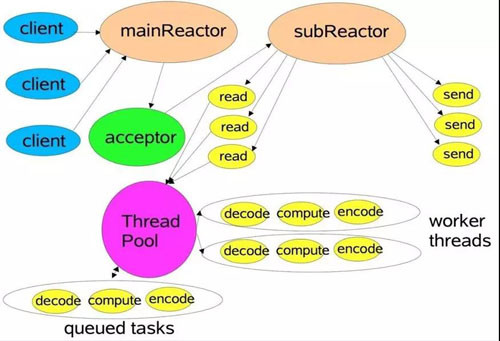

# 多线程模型 - Reactor
+ [Scalable IO in Java](http://gee.cs.oswego.edu/dl/cpjslides/nio.pdf)
- [Netty中线程池NioEventLoopGroup初始化流程解析](https://www.jianshu.com/p/2e3ae43dc4cb)
- [NIO学习--Reactor模型](https://blog.csdn.net/qq924862077/article/details/81026740)
- [Reactor模式](https://www.cnblogs.com/crazymakercircle/p/9833847.html)

  

Netty的线程模型被称为Reactor模型，具体如图所示。  

mainReactor(即bossGroup)，一般都是单线程，**这个线程池处理客户端的连接请求，并将accept的连接注册到subReactor的其中一个线程上；**

subReactor(即workGroup)，实际工作线程数一般根据业务配置
(e.g. dubbo `int DEFAULT_IO_THREADS = Math.min(Runtime.getRuntime().availableProcessors() + 1, 32))`，
**负责处理已建立的客户端通道上的数据读写；**  

图上还有一块ThreadPool是具体的处理业务逻辑的线程池，一般情况下可以复用subReactor，
但官方建议处理一些较为耗时的业务时还是要使用单独的ThreadPool。
 如何做？ 可能是 work只负责数据的读写，handler中再多线程处理信息。
例如 workThreads = 8，handlerThreads = 8。那么总共有 9个线程池对象，64个线程

`ServerBootstrap` 中`handler()`和`childHandler()`的区别是：  
`handler()/option()`是发生在**初始化的时候**
`childHandler()/childOption()`是发生在**客户端连接之后**。

**Reactor 优点：  **
1) 响应快，不必为单个同步时间所阻塞，虽然Reactor本身依然是同步的；

2) 编程相对简单，可以最大程度的避免复杂的多线程及同步问题，并且避免了多线程/进程的切换开销；

3) 可扩展性，可以方便的通过增加Reactor实例个数来充分利用CPU资源；

4) 可复用性，reactor框架本身与具体事件处理逻辑无关，具有很高的复用性；

**Reactor 缺点：  **
1) 相比传统的简单模型，Reactor增加了一定的复杂性，因而有一定的门槛，并且不易于调试。

2) Reactor模式需要底层的Synchronous Event Demultiplexer支持，比如Java中的Selector支持，操作系统的select系统调用支持，
如果要自己实现Synchronous Event Demultiplexer可能不会有那么高效。

3) Reactor模式在IO读写数据时还是在同一个线程中实现的，
即使使用多个Reactor机制的情况下，那些共享一个Reactor的Channel如果出现一个长时间的数据读写，会影响这个Reactor中其他Channel的相应时间，
比如在大文件传输时，IO操作就会影响其他Client的相应时间，
因而对这种操作，使用传统的Thread-Per-Connection或许是一个更好的选择，或则此时使用改进版的Reactor模式如Proactor模式。

## Reactor(non-blocking sync-io) VS Proactor(async-io)
- [如何深刻理解Reactor和Proactor？](https://www.zhihu.com/question/26943938)

Reactor模式，本质就是当IO事件(如读写事件)触发时，通知我们主动去读取，也就是要我们主动将socket接收缓存中的数据读到应用进程内存中。  
Proactor模式，我们需要指定一个应用进程内的buffer(内存地址)，交给系统，当有数据包到达时，则写入到这个buffer并通知我们收了多少个字节。

Reactor框架中用户定义的操作是在**实际操作之前调用**的。比如你定义了操作是要向一个SOCKET写数据，那么当该SOCKET可以接收数据的时候，你的操作就会被调用；  
Proactor框架中用户定义的操作是在**实际操作之后调用**的。比如你定义了一个操作要显示从SOCKET中读入的数据，那么当读操作完成以后，你的操作才会被调用。

2020-03-23 >>>> ChannelPipeline#close()
/**
 * Request to close the {@link Channel} and notify the {@link ChannelFuture} once the operation completes,
 * either because the operation was successful or because of
 * an error.
 *
 * After it is closed it is not possible to reuse it again.
 * 

 * This will result in having the
 * {@link ChannelOutboundHandler#close(ChannelHandlerContext, ChannelPromise)}
 * method called of the next {@link ChannelOutboundHandler} contained in the {@link ChannelPipeline} of the
 * {@link Channel}.
 */

2020-03-23 >>>> 
- [关于Netty使用是两个ChildHandler与使用异步线程的效率问题](https://segmentfault.com/q/1010000002800865)

2020-03-23 >>>>
Netty中的所有handler都实现自ChannelHandler接口。  
按照输出输出来分，分为ChannelInboundHandler、ChannelOutboundHandler两大类。

ChannelInboundHandler对从客户端发往服务器的报文进行处理，一般用来执行解码、读取客户端数据、进行业务处理等；  
ChannelOutboundHandler对从服务器发往客户端的报文进行处理，一般用来进行编码、发送报文到客户端。

1、ChannelInboundHandler之间的传递，通过调用 ctx.fireChannelRead(msg) 实现；调用ctx.write(msg) 将传递到ChannelOutboundHandler。
（InboundAdapter / OutboundAdapter 中基于模版方法可能已经调用 ctx.fireChannelRead()，所以**可能**不需要手动调用 ）

2、ctx.write()方法执行后，需要调用flush()方法才能令它立即执行。

3、**ChannelOutboundHandler 在注册的时候需要放在最后一个ChannelInboundHandler之前，否则将无法传递到ChannelOutboundHandler。**
（如果调用的是ctx.channel().write()是从尾开始执行，不会上述问题，如果是直接用ctx.write()时则会有博主说的问题）

4、**Handler的消费处理放在最后一个处理。**

2020-03-23 >>>> Handler的执行顺序
- [ChannelHandler lifecycle](https://www.jianshu.com/p/96a50869b527)
- [Handler的执行顺序](https://www.cnblogs.com/zeroone/p/8490930.html)

> Netty中，可以注册多个handler。
> ChannelInboundHandler按照注册的先后 **顺序执行**
> ChannelOutboundHandler按照注册的先后顺序 **逆序执行**