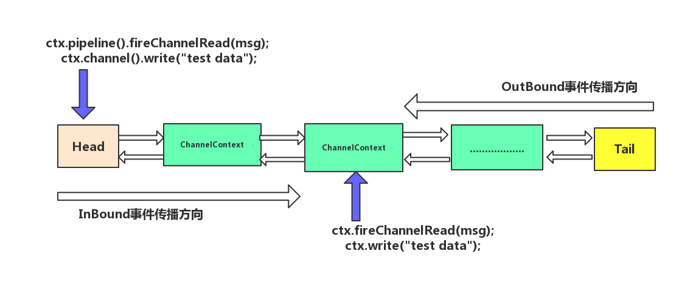
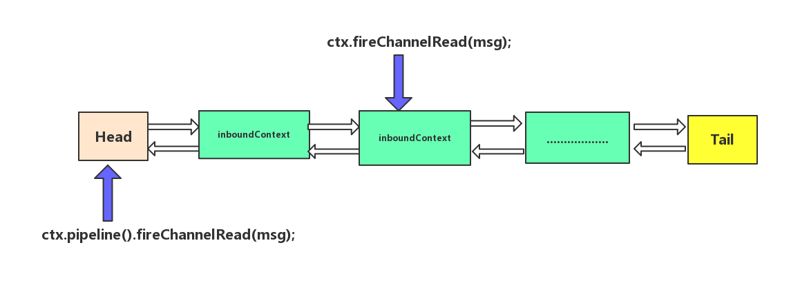

# 【002】Netty, Inbound & Outbound.MD

+ [Stack Overflow上Netty作者Trustin Lee对inbound和outbound的解释](https://stackoverflow.com/questions/22354135/in-netty4-why-read-and-write-both-in-outboundhandler)

- [如何理解Netty中的Inbound和Outbound](https://wallenwang.com/2019/06/understand-netty-inbound-outbound/)
- [inBound和outBound事件的传播过程](https://www.jianshu.com/p/772f14930f83)：<font color="red">文中存在严重错误，inbound/outbound 写反了（评论中有提到，ctx.fireXxx 是从当前节点往后传播）</font>


inbound和outbound并非指IO的输入和输出，而是指事件类型（触发事件的源头）。
inbound是事件，outbound是操作（直接导致的事件）。

1. Inbound
由外部触发的事件是inbound事件。
外部是指应用程序之外，因此inbound事件就是并非因为应用程序主动请求做了什么而触发的事件。

比如某个socket上有数据读取进来了（注意是“读完了”这个事件，而不是“读取”这个操作），
再比如某个socket连接了上来并被注册到了某个EventLoop。

2. Outbound
而outbound事件是由应用程序主动请求而触发的事件，
可以认为，outbound是指应用程序发起了某个操作。
比如向socket写入数据，再比如从socket读取数据（注意是“读取”这个操作请求，而非“读完了”这个事件），这也解释了为什么ChannelOutboundHandler中会有read方法。


inBound事件，最典型的就是读取数据流，加工处理；

## code


```java
public class MultiHandlerNettyServer {
    public static final int INET_PORT = 8081;
    public static final String INET_HOST = "127.0.0.1";

    public static void main(String[] args) {
        ServerBootstrap serverBootstrap = new ServerBootstrap();
        NioEventLoopGroup boss = new NioEventLoopGroup(1, new DefaultThreadFactory("NettyServerBoss"));
        NioEventLoopGroup worker = new NioEventLoopGroup(NettyEventLoopFactory.DEFAULT_IO_THREADS, new DefaultThreadFactory("NettyServerWork"));
        ChannelFuture channelFuture = serverBootstrap.group(boss, worker)    // 1. 线程模型
                .channel(NioServerSocketChannel.class)  // 2. IO模型
                .childHandler(new ChannelInitializer<NioSocketChannel>() {  // 3. 连接读写处理逻辑
                    @Override
                    protected void initChannel(NioSocketChannel ch) {
                        ch.pipeline()
                                /* 调用顺序，特别 index:7 只打印了1次！
                                    inbound >>>> index: 1, invoke-method: channelRead
                                    inbound >>>> index: 2, invoke-method: channelRead
                                    inbound >>>> index: 3, invoke-method: channelRead
                                    inbound & outbound >>>> index: 7, invoke-method: channelRead
                                    outbound >>>> index: 6, invoke-method: write
                                    outbound >>>> index: 5, invoke-method: write
                                    outbound >>>> index: 4, invoke-method: write
                                 */

                                // inbound 正序调用
                                .addLast(new StringDecoder())
                                .addLast(new CustomInboundHandler1())
                                .addLast(new CustomInboundHandler2())
                                .addLast(new CustomInboundHandler3())

                                // outbound 逆序调用，且必须定义在最后一个Inbound之前
                                .addLast(new CustomOutboundHandler4())
                                .addLast(new CustomOutboundHandler5())
                                .addLast(new CustomOutboundHandler6())

                                /* inbound & outbound
                                 * outbound 必须定义在最后一个 inbound前，所以此处只会用到 inbound。（待求证！！！）
                                 */
                                .addLast(new CustomInAndOutboundHandler7());
                    }
                })
                .bind(INET_PORT);// 4. 绑定端口
    }
}
```




### ` ctx.fireChannelRead(msg)` VS `ctx.pipeline().fireChannelRead(msg);`



```
@Override
public void channelRead(ChannelHandlerContext ctx, Object msg) throws Exception {
   // 通过当前节点往下传播事件
   ctx.fireChannelRead(msg);

   // 通过头节点往下传递事件
   ctx.pipeline().fireChannelRead(msg);
}
```

