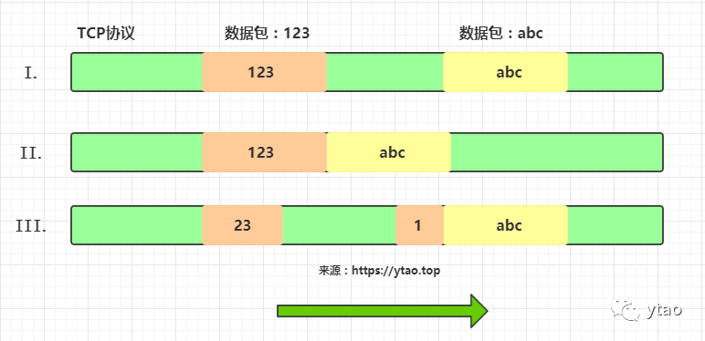

# 【003】Netty, 粘包 & 拆包.MD

- [Netty中粘包/拆包处理](https://mp.weixin.qq.com/s/oeSWUfSgcHGv3xpegCFOSw)

粘包：sticky packet???    
拆包：unpack  

## 粘包/拆包描述
假设当前有`123`和`abc`两个数据包，那么他们传输情况示意图如下：  

- I 为正常情况，两次传输两个独立完整的包。
- II 为粘包情况，`123` 和 `abc` 封装成了一个包。
- III 为拆包情况，图中的描述是将`123`拆分成了`1`和`23`，并且`1`和`abc`一起传输。
`123`和`abc`也可能是`abc`进行拆包。甚至`123`和`abc`进行多次拆分也有可能。

## 解决方案
**明确消息结束的标志。**  
不管是，根据 分隔符 还是 长度，其目的都是 明确一条完整消息 的边界。

- io.netty.handler.codec.LineBasedFrameDecoder: "\n" or "\r\n"
- io.netty.handler.codec.DelimiterBasedFrameDecoder: 自定义分隔符
- io.netty.handler.codec.FixedLengthFrameDecoder: 固定长度
- io.netty.handler.codec.LengthFieldBasedFrameDecoder: 动态长度，每条消息的长度都是随着消息头进行指定

均继承`ByteToMessageDecoder extends ChannelInboundHandlerAdapter`。
