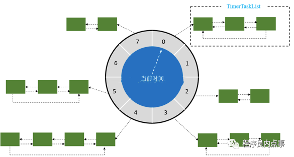

# 【100】feat - Wheel Timer.MD

usage:
- dubbo, HashedWheelTimer 

## 时间轮 WheelTimer
- [菜鸟自研定时任务调度](https://mp.weixin.qq.com/s/QxV4-sa72ALCZdD4QWqLPA)
- [kafka时间轮解析](https://www.jianshu.com/p/87240220097b)

> [6种 延时队列的实现方法](https://mp.weixin.qq.com/s/BaM37EI3zJY-PfIIDAJNwQ)

时间轮的原理图：


`wheel`：  
时间轮，图中的圆盘可以看作是钟表的刻度。比如一圈`round` 长度为`24秒`，刻度数为 `8`，那么每一个刻度表示 `3秒`。  
那么**时间精度**就是 `3秒`。  
时间长度 / 刻度数值越大，精度越大。  

当添加一个 定时/延时`任务A`，假如会延迟`25秒`后才会执行，可时间轮一圈`round` 的长度才`24秒`，
那么此时会根据时间轮长度和刻度得到一个圈数 `round`和对应的指针位置 `index`，也是就`任务A`会绕一圈指向`0格子`上，
此时时间轮会记录该任务的`round`和`index`信息。  
当`round=0,index=0`指针指向`0格子`，`任务A`并不会执行，因为round=0不满足要求。  

Netty构建延时队列主要用`HashedWheelTimer`，`HashedWheelTimer`底层数据结构依然是使用`java.util.concurrent.DelayQueue`，**只是采用时间轮的算法来实现**。

```text
tickDuration和unit：每格的时间间隔，默认100ms；

ticksPerWheel：一圈下来有几格，默认512，而如果传入数值的不是2的N次方，则会调整为大于等于该参数的一个2的N次方数值，有利于优化hash值的计算。

ThreadFactory：表示用于生成工作线程，一般采用线程池；
TimerTask：一个定时任务的实现接口，其中run方法包装了定时任务的逻辑。
Timeout：一个定时任务提交到Timer之后返回的句柄，通过这个句柄外部可以取消这个定时任务，并对定时任务的状态进行一些基本的判断。
Timer：是HashedWheelTimer实现的父接口，仅定义了如何提交定时任务和如何停止整个定时机制。
```
